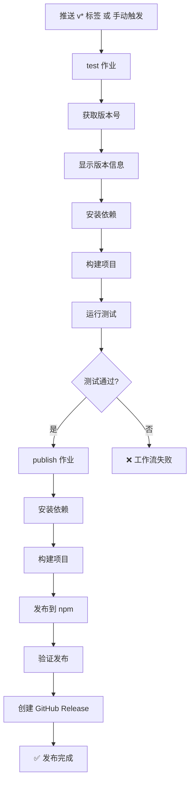

# GitHub Actions 发布指南

本文档说明如何使用 GitHub Actions 自动发布 `novelws` 到 npm。

## 📋 目录

- [自动发布（推荐）](#自动发布推荐)
- [手动触发发布](#手动触发发布)
- [发布状态检查](#发布状态检查)
- [前置条件](#前置条件)
- [故障排查](#故障排查)

---

## 自动发布（推荐）

### 触发条件

当你推送一个 `v*` 格式的 git 标签时，GitHub Actions 会自动触发发布流程。

### 操作步骤

1. **更新版本号**

```bash
# 编辑 package.json，将 version 更新为新版本（如 3.0.0）
```

2. **提交更改**

```bash
git add package.json CHANGELOG.md README.md
git commit -m "chore: bump version to 3.0.0"
```

3. **创建并推送标签**

```bash
# 创建标签
git tag -a v3.0.0 -m "Release v3.0.0 - Your release message"

# 推送代码和标签
git push origin main --tags
```

4. **等待自动发布**

- GitHub Actions 会自动运行发布工作流
- 大约 5-10 分钟后完成
- 访问 https://github.com/binlee1990/novel-writer-skills/actions 查看进度

---

## 手动触发发布

如果需要手动触发发布（不依赖标签），可以使用 GitHub Actions UI。

### 操作步骤

1. **访问 Actions 页面**

```
https://github.com/binlee1990/novel-writer-skills/actions
```

2. **选择 Publish 工作流**

- 点击左侧 "Publish" 工作流
- 点击右上角 "Run workflow" 按钮

3. **配置参数**

- **Branch**: 选择 `main` 分支
- **Version**（可选）: 输入要发布的版本号（如 `3.0.0`）
  - 如果不填，将使用 `package.json` 中的版本号

4. **运行工作流**

- 点击 "Run workflow" 绿色按钮
- 等待工作流完成

---

## 发布状态检查

### 使用 PowerShell 脚本

项目包含一个检查脚本，可以快速验证发布状态：

```powershell
# Windows PowerShell
.\scripts\check-publish-status.ps1
```

脚本会检查：

- ✅ 本地 `package.json` 版本
- ✅ npm 仓库当前版本和发布时间
- ✅ GitHub 标签列表
- ✅ GitHub Actions 运行状态（需要 `gh` CLI）
- ✅ 提供验证安装命令和相关链接

### 手动检查

#### 1. 检查 npm 版本

```bash
npm view novelws version
```

#### 2. 检查 GitHub Actions

访问：https://github.com/binlee1990/novel-writer-skills/actions/workflows/publish.yml

#### 3. 检查 GitHub Releases

访问：https://github.com/binlee1990/novel-writer-skills/releases

#### 4. 验证安装

```bash
npm install -g novelws@3.0.0
novelws --version
```

---

## 前置条件

### 1. NPM_TOKEN 配置

发布工作流需要 `NPM_TOKEN` secret。

#### 生成 npm Access Token

1. 登录 npm：https://www.npmjs.com
2. 访问：Settings → Access Tokens
3. 点击 "Generate New Token" → "Classic Token"
4. 选择类型：**Automation**
5. 复制生成的 token

#### 添加到 GitHub Secrets

1. 访问仓库 Settings：https://github.com/binlee1990/novel-writer-skills/settings/secrets/actions
2. 点击 "New repository secret"
3. Name: `NPM_TOKEN`
4. Value: 粘贴你的 npm token
5. 点击 "Add secret"

### 2. NPM 包权限

确保你的 npm 账号是 `novelws` 包的：

- Owner（所有者）
- Maintainer（维护者）

检查权限：

```bash
npm owner ls novelws
```

---

## 工作流详解

### 工作流文件

`.github/workflows/publish.yml`

### 执行流程



### 作业说明

#### test 作业

- 环境：Ubuntu Latest + Node.js 22
- 步骤：
  1. 检出代码
  2. 获取版本号（从标签或手动输入）
  3. 显示版本信息
  4. 安装依赖（`npm ci`）
  5. 构建项目（`npm run build`）
  6. 运行测试（`npm test`）
- 输出：`version`（用于 publish 作业）

#### publish 作业

- 环境：Ubuntu Latest + Node.js 22
- 依赖：`test` 作业通过
- 权限：`contents: write`, `id-token: write`
- 步骤：
  1. 检出代码
  2. 配置 npm registry
  3. 安装依赖
  4. 构建项目
  5. 发布到 npm（带 provenance）
  6. 验证发布（等待 30 秒后检查）
  7. 创建 GitHub Release

---

## 故障排查

### 问题 1: 发布失败 - NPM_TOKEN 错误

**错误信息**：

```
npm ERR! code E401
npm ERR! Unable to authenticate
```

**解决方案**：

1. 检查 GitHub Secrets 中的 `NPM_TOKEN` 是否存在
2. 重新生成 npm token（选择 **Automation** 类型）
3. 更新 GitHub Secret

### 问题 2: 发布失败 - 版本已存在

**错误信息**：

```
npm ERR! code E403
npm ERR! You cannot publish over the previously published versions
```

**解决方案**：

1. npm 不允许覆盖已发布的版本
2. 更新 `package.json` 中的版本号
3. 创建新的 git 标签并推送

### 问题 3: 测试失败

**错误信息**：

```
FAIL tests/...
```

**解决方案**：

1. 在本地运行 `npm test` 确保所有测试通过
2. 修复失败的测试
3. 提交并重新推送

### 问题 4: GitHub Release 创建失败

**错误信息**：

```
Error: Resource not accessible by integration
```

**解决方案**：

1. 检查工作流权限（需要 `contents: write`）
2. 确保标签已经存在
3. 检查 `softprops/action-gh-release` action 版本

### 问题 5: 手动触发找不到

**症状**：

GitHub Actions 页面没有 "Run workflow" 按钮

**解决方案**：

1. 确保 `.github/workflows/publish.yml` 包含 `workflow_dispatch` 触发器
2. 确保该文件已推送到 `main` 分支
3. 刷新 GitHub Actions 页面

---

## 最佳实践

### 1. 版本号规范

遵循语义化版本（Semantic Versioning）：

- **MAJOR.MINOR.PATCH**（如 `3.0.0`）
- MAJOR：不向后兼容的 API 更改
- MINOR：向后兼容的新功能
- PATCH：向后兼容的 bug 修复

### 2. 发布前检查

```bash
# 1. 确保所有测试通过
npm test

# 2. 确保构建成功
npm run build

# 3. 检查 package.json 版本号
cat package.json | grep version

# 4. 检查 CHANGELOG.md 已更新
git diff CHANGELOG.md
```

### 3. 发布后验证

```bash
# 1. 等待 3-5 分钟让 npm 更新

# 2. 检查 npm 版本
npm view novelws version

# 3. 全局安装测试
npm install -g novelws@3.0.0
novelws --version

# 4. 检查 GitHub Release
# 访问 https://github.com/binlee1990/novel-writer-skills/releases
```

### 4. 回滚策略

如果发布有问题：

```bash
# 1. 废弃有问题的版本（不删除）
npm deprecate novelws@3.0.0 "This version has issues, please use 3.0.1"

# 2. 修复问题并发布新版本
# 更新 package.json version -> 3.0.1
git add package.json
git commit -m "chore: bump version to 3.0.1"
git tag -a v3.0.1 -m "Release v3.0.1 - Fix issues in 3.0.0"
git push origin main --tags
```

---

## 相关链接

- **npm 包页面**: https://www.npmjs.com/package/novelws
- **GitHub Actions**: https://github.com/binlee1990/novel-writer-skills/actions
- **GitHub Releases**: https://github.com/binlee1990/novel-writer-skills/releases
- **GitHub Secrets**: https://github.com/binlee1990/novel-writer-skills/settings/secrets/actions

---

## 附录：工作流配置示例

### 自动触发（标签）

```yaml
on:
  push:
    tags:
      - 'v*'
```

### 手动触发

```yaml
on:
  workflow_dispatch:
    inputs:
      version:
        description: 'Version to publish (e.g., 3.0.0)'
        required: false
        type: string
```

### npm 发布

```yaml
- name: Publish to npm
  run: npm publish --provenance --access public
  env:
    NODE_AUTH_TOKEN: ${{ secrets.NPM_TOKEN }}
```

### GitHub Release

```yaml
- name: Create GitHub Release
  uses: softprops/action-gh-release@v2
  with:
    tag_name: v${{ needs.test.outputs.version }}
    name: Release v${{ needs.test.outputs.version }}
    generate_release_notes: true
```

---

**最后更新**: 2026-02-14
**维护者**: Novel Writer Team
