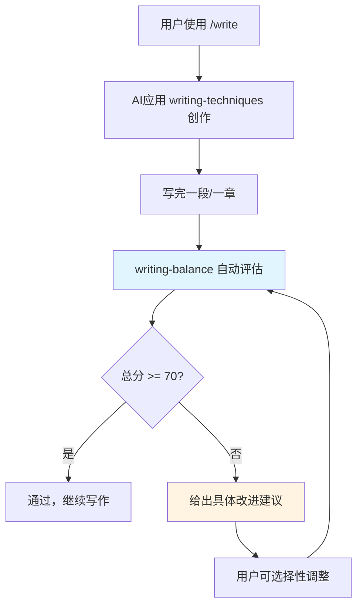
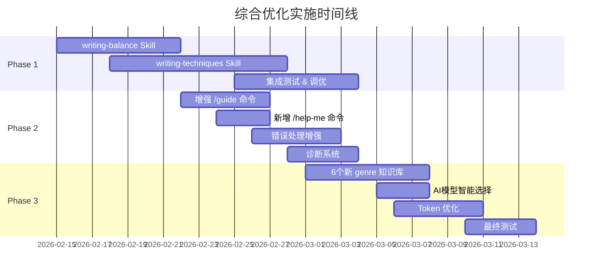

# Novel Writer Skills - 综合优化设计文档

**设计日期**: 2026-02-14
**版本**: 1.0
**目标版本**: v3.1.0
**设计者**: Claude Sonnet 4.5

---

## 📋 设计概述

### 背景

v3.0.0 成功实现了超长篇小说支持（MCP + SQLite + 分片JSON），性能提升100x-600x。在此基础上，本次优化聚焦于**创作质量**和**用户体验**提升。

### 核心问题

通过用户反馈和项目分析，识别出以下关键问题：

1. **AI去味规则过于激进**（最高优先级）
   - 现有 `anti-ai-v4.md` 采用禁止列表策略，导致：
     - ✅ 成功消除AI痕迹
     - ❌ 但牺牲了文学性、自然表达、阅读体验
   - 具体表现：
     - 短句过多（80%<15字），缺乏长短句变化
     - 词汇重复（禁用词太多，只能用"安全词"）
     - 描写单一（形容词限制3个/100字，过于贫瘠）
     - 过度避免某些词汇（连"一言难尽"都不让用）

2. **命令发现困难**
   - 17个命令，新用户不知道何时该用哪个
   - 缺乏上下文感知的智能推荐

3. **错误处理不友好**
   - 错误信息不清晰
   - 缺乏修复建议和自动诊断

4. **功能扩展需求**
   - 当前8个genre不够，需要更多类型知识库
   - AI模型选择缺乏指导

5. **Token消耗可优化**
   - `track.md` (1079行)、`analyze.md` 等大型命令仍有精简空间

### 优先级排序

基于用户反馈：

1. **P0 - AI去味规则优化**（核心创作质量）
2. **P1 - 命令发现增强**（降低上手门槛）
3. **P1 - 错误处理增强**（提升稳定性）
4. **P2 - 功能扩展**（genre知识库、AI模型优化）
5. **P3 - Token优化**（如复杂度不高则实施）

### 解决方案：三阶段全面优化

- **Phase 1**: 创作质量核心（AI去味智能化）- 2-3周
- **Phase 2**: 用户体验提升（命令发现 + 错误处理）- 1-2周
- **Phase 3**: 功能扩展与优化（genre + AI模型 + Token）- 1-2周

**总工期**: 4-7周

---

## 🎨 Phase 1: 创作质量核心 - AI去味智能化

### 设计理念转变

**从"禁止列表"转向"平衡评分"**

| 维度 | v4.0 激进版 | v5.0 平衡版 |
|------|------------|------------|
| **方法论** | 禁止清单（200+词） | 多维度评分（6个指标） |
| **句长控制** | 强制80%<15字 | 灵活分布（短30-40% 中40-50% 长10-20%） |
| **形容词** | 限制3个/100字 | 允许4-8个/100字，要求多样化 |
| **成语** | 完全禁用 | 允许口语成语（≤5个/1000字） |
| **句式** | 完全禁止某些句式 | 限制频率，不完全禁止 |
| **目标** | 零AI痕迹（牺牲文学性） | 平衡AI识别度与自然表达 |

### 核心组件

#### 1. `writing-balance` Skill（智能平衡监控）

**文件**: `templates/skills/writing-techniques/writing-balance/SKILL.md`

**功能**: 实时监控写作平衡度，提供多维度评分（不强制100分，70-85分即为优秀）

**核心指标（6个维度）**:

##### 1.1 句长分布平衡度 (Sentence Length Distribution)

**检测标准**:
- 短句（<12字）: 30-40%
- 中句（12-25字）: 40-50%
- 长句（>25字）: 10-20%

**AI问题**: v4强制80%短句 → 节奏单一
**新规则**: 允许长短句混合，只要分布合理

**示例**:
```
✅ 优秀分布：
  短句38% 中句48% 长句14% → 评分: 90/100

⚠️ 需改进：
  短句72% 中句25% 长句3% → 评分: 55/100
  建议: 增加2-3个长句（>30字）丰富节奏
```

##### 1.2 词汇丰富度 (Lexical Diversity)

**检测标准**:
- TTR (Type-Token Ratio) > 0.65（每100字不重复词汇率）
- 同义词轮换检测

**AI问题**: v4限制词汇 → 重复使用"安全词"
**新规则**: 鼓励同义词变化

**示例**:
```
⚠️ 词汇重复：
  "说"出现8次 → 评分: 60/100
  建议同义词: 讲、开口、道、答、回、问、应
```

##### 1.3 描写层次感 (Descriptive Depth)

**检测标准**:
- 感官分布: 视觉40% | 听觉20% | 触/嗅/味40%
- 形容词密度: 4-8个/100字（v4限制3个太少）
- 动/名/形平衡: 5:3:2

**AI问题**: v4删除所有装饰词 → 描写贫瘠
**新规则**: 允许适度形容词，但要求多样化

##### 1.4 成语/四字词使用度 (Idiom Usage)

**检测标准**:
- ≤5个成语/1000字
- 口语化成语优先（"一言难尽" > "肝肠寸断"）
- 避免连续使用

**AI问题**: v4完全禁用成语 → 过于白话
**新规则**: 允许口语成语，禁止文言成语

**白名单示例**（口语化成语，可用）:
- 一言难尽、莫名其妙、不以为然、若无其事、心照不宣

**黑名单示例**（文言成语，避免）:
- 肝肠寸断、踌躇满志、从容不迫、五味杂陈、百感交集

##### 1.5 句式变化度 (Sentence Pattern Variety)

**检测标准**:
- 避免连续3个以上相同句式
- 主谓宾/倒装/省略/疑问句混合
- AI高频句式限制频率（不完全禁止）

**AI问题**: v4完全禁止"在...下"、"仿佛...一般" → 表达受限
**新规则**: 限制频率（≤2次/1000字），不完全禁止

##### 1.6 自然度评分 (Naturalness Score)

**检测标准**:
- 标点变化: 句号70% | 问号10% | 感叹号5% | 逗号/顿号15%
- 段落长度: 1-6句混合（不强制≤4句）
- 对话真实: 语气词、口头禅、未完成句

**输出格式示例**:
```yaml
平衡度评估报告：
  总分：78/100 (良好)

  详细维度：
    句长分布：85/100 ✅ (短30% 中50% 长20%)
    词汇丰富度：72/100 ⚠️ ("说"出现8次，建议轮换)
    描写层次：68/100 ⚠️ (形容词偏少，建议增加触觉描写)
    成语使用：90/100 ✅ (仅2个，且均为口语化)
    句式变化：65/100 ⚠️ (连续5个主谓宾结构)
    自然度：80/100 ✅ (段落长度自然)

  改进建议：
    1. 增加1-2个长句（>30字）丰富节奏
    2. "说"的同义词：讲、开口、道、答
    3. 第3段加入嗅觉描写（咖啡香气）
```

---

#### 2. `writing-techniques` Skill（写作技巧教学）

**文件**: `templates/skills/writing-techniques/writing-techniques/SKILL.md`

**功能**: 从正面教授写作技巧，而非负面禁止

**教学模块（8个）**:

##### 2.1 标点符号艺术
- 省略号3种用法：思考、未尽之意、语音延长
- 破折号节奏控制：转折、解释、声音
- 句号vs逗号的节奏把控

##### 2.2 句式变化技巧
- 长短句配合："长铺垫 + 短点题"模式
- 倒装强调："门，开了" vs "门开了"
- 省略句留白："他走了。没回头。"

##### 2.3 描写手法
- 五感交叉描写（不只视觉）
- 动静结合："雨打在窗上" + "屋里很安静"
- 侧面烘托：不直接说"她很美"，写"路人都在看她"

##### 2.4 对话真实化
- 语气词自然使用："啊、吧、呢、哦"
- 未完成句："我...我不是..."
- 口头禅/方言点缀

##### 2.5 节奏控制
- 快节奏：短句 + 动词密集 + 少形容词
- 慢节奏：长句 + 描写细腻 + 多感官
- 情绪递进：句子逐渐变短/变长

##### 2.6 留白艺术
- 段落间空白（时间跳跃/场景切换）
- 未说之意："他看了她一眼。转身走了。"
- 读者想象空间

##### 2.7 词汇选择原则
- 具体>抽象："拿铁">"咖啡">"饮料"
- 动词优先："门砰地关上" > "门被关上了"
- 避免过度修饰："很好"够了，不需要"非常特别极其好"

##### 2.8 AI痕迹识别与规避
- AI高频词表（100个）+ 替代方案
- AI典型句式（20种）+ 改写示例
- **控制频率**而非**完全禁止**

---

#### 3. 两个Skill的协同工作流程



**关键点**:
- 不强制100分（过度优化会僵化）
- 平衡才是目标（70-85分即为优秀）
- 保留作者风格（配置文件可调整阈值）

---

#### 4. 与现有系统的整合

**替换策略**:
1. **保留** `anti-ai-v4.md` → 改名为 `anti-ai-v4-deprecated.md`（仅作参考）
2. **新增** `anti-ai-v5-balanced.md`（平衡版规则，提炼自两个Skill）
3. **更新** `/write` 命令，自动激活两个新Skill
4. **配置化**: 在 `specification.md` 中允许用户自定义阈值

**配置示例**（specification.md）:
```yaml
writing_balance_config:
  strictness: medium  # strict | medium | loose
  sentence_length_target:
    short: 35%
    medium: 50%
    long: 15%
  allow_idioms: true
  idiom_limit_per_1000: 5
  adjective_density: 6  # per 100 words
  custom_whitelist:  # 用户自定义允许词
    - "某个特殊成语"
  custom_blacklist:  # 用户自定义禁用词
    - "某个讨厌的词"
```

---

### Phase 1 交付物

1. **新增文件**（2个）:
   - `templates/skills/writing-techniques/writing-balance/SKILL.md` (~800行)
   - `templates/skills/writing-techniques/writing-techniques/SKILL.md` (~1000行)

2. **更新文件**（3个）:
   - `templates/knowledge-base/requirements/anti-ai-v4.md` → `anti-ai-v4-deprecated.md`
   - `templates/knowledge-base/requirements/anti-ai-v5-balanced.md`（新增）
   - `templates/commands/write.md`（集成新Skill）

3. **测试**:
   - 单元测试：评分算法正确性
   - 集成测试：与 `/write` 命令集成
   - 实战测试：实际写作场景验证平衡度

---

## 🎨 Phase 2: 用户体验提升

### 2.1 命令发现系统

#### 问题分析

17个命令，用户面临的困境：
- 不知道什么时候该用哪个命令
- 不知道命令之间的先后顺序
- 不知道如何用自然语言描述需求

#### 解决方案1: 增强 `/guide` 命令

**当前功能**: 三层优先级推荐（P0/P1/P2）

**新增功能**:

##### 上下文感知推荐

检测项目状态：
- 文件存在性：specification.md、creative-plan.md、tasks.md、章节数
- 最近操作：上次命令（从.claude/history读取，如可行）
- 问题检测：tracking文件过大、MCP未启用、目录结构异常

**决策逻辑**:
```yaml
IF 无 specification.md:
  推荐: /specify 或 /constitution
ELSE IF 有 specification.md 但无 creative-plan.md:
  推荐: /plan
ELSE IF 有 plan 但无 tasks.md:
  推荐: /tasks
ELSE IF 有 tasks 但章节数=0:
  推荐: /write
ELSE IF 章节数 > 0:
  推荐: /analyze 或 /track --sync

IF tracking 文件 > 50KB:
  警告: /track --migrate --target sharded
IF 章节数 > 300 且无 MCP:
  警告: 考虑启用 MCP（/track --migrate --target mcp）
```

##### 新手引导模式

- **首次使用**: 完整七步方法论流程图
- **第2-5次**: 简化提示 + 当前步骤高亮
- **熟练后**: 仅显示异常提醒

**示例输出**:
```yaml
📍 当前状态：已完成 specification.md 和 creative-plan.md

🎯 推荐下一步：
1. /tasks - 分解任务清单（必做）
2. /character create - 创建主角卡片（建议）

💡 可选操作：
- /clarify - 如果还有疑问
- /plan --detail vol-01 - 细化第一卷大纲

⚠️ 异常提醒：
- spec/tracking/ 目录为空，建议先运行 /track-init
```

---

#### 解决方案2: 新增 `/help-me` 命令

**功能**: 自然语言查询 → 推荐命令

**文件**: `templates/commands/help-me.md`

**实现方式**:
```markdown
你是命令推荐助手。用户会用自然语言描述需求，你需要：
1. 理解用户意图
2. 推荐最合适的命令
3. 给出使用示例和相关命令

## 常见场景映射表（50+场景）

### 角色管理
- "修改角色性格" → /character update <角色名>
- "查看角色卡片" → /character show <角色名>
- "创建新角色" → /character create

### 情节管理
- "检查时间线矛盾" → /timeline
- "查看角色关系" → /relations
- "追踪情节线" → /track --check

### 内容查询
- "查找某个情节" → /search <关键词> (需MCP)
- "生成第X卷摘要" → /volume-summary --volume vol-0X
- "回顾前情" → /recap --brief

### 质量分析
- "分析最近3章节奏" → /analyze --focus=pacing --range ch-10-12
- "检查人物对话" → /analyze --focus=voice
- "检查伏笔" → /analyze --focus=foreshadow

### 系统操作
- "迁移到大型项目模式" → /track --migrate --target sharded
- "同步追踪数据" → /track --sync
- "查看创作统计" → /track --stats
```

**用户体验示例**:
```bash
用户输入: /help-me 我想修改角色的性格设定

AI输出:
📌 推荐命令：/character update

用法示例：
  /character update 李明

这个命令会：
1. 读取当前角色卡片（spec/knowledge/characters/李明.md）
2. 让你修改性格、背景、能力等信息
3. 自动更新文件
4. 同步更新 tracking 数据（如已启用）

💡 相关命令：
- /character show 李明 - 查看当前设定
- /track --sync - 同步修改到追踪文件
- /character voice 李明 - 分析角色对话风格

📖 详细文档：运行 /expert character 获取角色塑造专家咨询
```

---

### 2.2 错误处理增强

#### 统一错误处理框架

**文件**: `src/core/errors.ts`（增强现有）

**新增错误类型**:

```typescript
/**
 * 文件缺失错误（带修复建议）
 */
class MissingFileError extends BaseError {
  constructor(filePath: string, suggestion: string) {
    super(
      `文件不存在: ${filePath}`,
      `💡 修复建议: ${suggestion}`
    );
    this.name = 'MissingFileError';
  }
}

// 使用示例
throw new MissingFileError(
  'spec/tracking/character-state.json',
  '运行 /track-init 初始化追踪系统'
);

/**
 * 模式不匹配错误
 */
class ModeMismatchError extends BaseError {
  constructor(
    expectedMode: string,
    actualMode: string,
    action: string
  ) {
    super(
      `模式不匹配: 当前项目使用 ${actualMode} 模式，但 ${action} 需要 ${expectedMode} 模式`,
      `💡 修复建议: 运行 /track --migrate --target ${expectedMode}`
    );
    this.name = 'ModeMismatchError';
  }
}

/**
 * 数据完整性错误
 */
class DataIntegrityError extends BaseError {
  constructor(issue: string, autoFixed: boolean) {
    super(
      `数据完整性问题: ${issue}`,
      autoFixed ? '✅ 已自动修复' : '⚠️ 需要手动检查'
    );
    this.name = 'DataIntegrityError';
  }
}

/**
 * 依赖缺失错误
 */
class DependencyMissingError extends BaseError {
  constructor(dependency: string, installCmd: string) {
    super(
      `缺少依赖: ${dependency}`,
      `💡 安装方法: ${installCmd}`
    );
    this.name = 'DependencyMissingError';
  }
}
```

---

#### 智能诊断系统

**功能**: 命令失败时自动诊断并给出修复步骤

**诊断清单**（5项）:
1. ✅ 检查必需文件是否存在
2. ✅ 检查文件格式是否正确（JSON格式验证）
3. ✅ 检查项目模式是否匹配（单文件/分片/MCP）
4. ✅ 检查依赖是否满足（MCP服务器、SQLite等）
5. ✅ 给出具体修复命令

**实现**:
```typescript
// src/utils/diagnostics.ts

export class ProjectDiagnostics {
  async diagnoseError(error: Error, context: CommandContext): Promise<DiagnosticReport> {
    const checks = [
      this.checkProjectStructure(),
      this.checkTrackingFiles(),
      this.checkProjectMode(),
      this.checkMCPStatus(),
      this.checkFileIntegrity()
    ];

    const results = await Promise.all(checks);
    return this.generateReport(error, results);
  }
}
```

**输出示例**:
```bash
# 用户运行：/search "某情节"

❌ /search 命令失败: MCP服务器未响应

🔍 诊断结果:
  ✅ 项目结构正常
  ✅ tracking 文件存在
  ❌ MCP 服务器未启动
  ❌ novel-tracking.db 不存在

💡 修复步骤:
  1. 运行迁移: /track --migrate --target mcp
  2. 检查 MCP 配置:
     打开 .claude/config.json
     确认 mcpServers.novelws-mcp 配置正确
  3. 启动 Claude Code 时确保 MCP 服务器已加载
  4. 重试: /search "某情节"

📖 详细文档: 运行 /help-me MCP配置
```

---

### Phase 2 交付物

1. **新增文件**（2个）:
   - `templates/commands/help-me.md` (~400行)
   - `src/utils/diagnostics.ts` (~300行)

2. **更新文件**（3个）:
   - `templates/commands/guide.md`（增强上下文感知）
   - `src/core/errors.ts`（新增错误类型）
   - `src/commands/*.ts`（集成诊断系统）

3. **测试**:
   - 单元测试：错误类型、诊断逻辑
   - 集成测试：命令推荐准确性
   - 用户测试：新手引导流程

---

## 🎨 Phase 3: 功能扩展与优化

### 3.1 扩展类型知识库

**当前状态**: 8个 genre
**新增**: 6个 genre

| Genre | 文件名 | 核心要素 | 文件大小 |
|-------|--------|---------|---------|
| **科幻** | `sci-fi.md` | 世界观设定、科技树、未来社会、思想实验 | ~500行 |
| **恐怖** | `horror.md` | 氛围营造、恐怖源、节奏控制、留白艺术 | ~450行 |
| **青春** | `youth.md` | 校园场景、成长弧光、情感细腻、时代感 | ~400行 |
| **军事** | `military.md` | 战术细节、军队体系、真实性、热血感 | ~550行 |
| **竞技** | `sports.md` | 比赛描写、训练过程、团队动力、逆袭套路 | ~450行 |
| **职场** | `workplace.md` | 行业细节、职场政治、专业感、现实主义 | ~500行 |

**每个 genre 知识库结构**:
```markdown
# Genre: [类型名称]

## 类型特征（200字）
核心定义、目标读者、典型设定

## 常见套路（10个）
1. 套路名称
   - 描述
   - 使用场景
   - 示例
   ...

## 禁忌/雷区（5-8个）
1. 雷区名称
   - 为什么是雷
   - 如何避免
   ...

## 爽点设计（该类型特有）
1. 爽点类型
   - 触发时机
   - 实现方式
   - 示例
   ...

## 节奏建议
- 开篇节奏
- 中期节奏
- 高潮节奏

## 推荐参考作品（5-10部）
- 作品名 - 作者 - 推荐理由
```

**示例：科幻类型**（部分内容）:
```markdown
# Genre: 科幻 (Sci-Fi)

## 类型特征
科幻小说以科学技术为核心，探索未来社会、宇宙探索、人工智能等主题。
强调科学逻辑自洽、世界观完整、思想实验深度。
目标读者：理工背景、喜欢硬核设定、追求思辨性。

## 常见套路
1. 赛博朋克都市
   - 高科技低生活、资本垄断、阶级分化
   - 使用场景：都市科幻、反乌托邦
   - 示例：霓虹灯下的贫民窟、义体改造诊所

2. 星际探索
   - 未知文明、第一接触、星际战争
   - 使用场景：太空歌剧、硬科幻
   - 示例：远征舰队发现古代遗迹

3. AI觉醒
   - 奇点来临、人机共存、意识上传
   - 使用场景：近未来、软科幻
   - 示例：AI开始质疑人类指令的合理性
   ...

## 禁忌/雷区
1. 科技设定前后矛盾
   - 为什么：破坏沉浸感
   - 避免：建立科技树，设定一致性检查

2. 无意义的技术堆砌
   - 为什么：炫技不等于好故事
   - 避免：科技为情节服务，不是反过来
   ...

## 爽点设计
1. 科技碾压
   - 触发时机：主角掌握领先科技
   - 实现方式：降维打击、黑科技亮相
   - 示例：用量子武器秒杀外星舰队

2. 真相揭示
   - 触发时机：世界观反转
   - 实现方式：层层剥开谜团
   - 示例：发现地球是外星文明的试验场
   ...
```

---

### 3.2 AI模型智能选择

#### 模型选择矩阵

| 任务类型 | 推荐模型 | 理由 | 可选模型 | 成本对比 |
|---------|---------|------|---------|---------|
| `/write` | **Opus 4.6** | 创作质量和细腻度 | Sonnet（--fast） | 1x |
| `/analyze` | **Sonnet 4.5** | 分析任务，质量与速度平衡 | Opus（深度分析） | 0.33x |
| `/track --sync` | **Haiku 4.5** | 数据更新，速度优先 | Sonnet | 0.05x |
| `/search` | **Haiku 4.5** | 简单查询 | - | 0.05x |
| `/plan` | **Opus 4.6** | 需要创意和规划能力 | Sonnet | 1x |
| `/revise` | **Sonnet 4.5** | 修改任务 | Opus（重大改写） | 0.33x |
| `/character create` | **Sonnet 4.5** | 角色设定，中等复杂度 | Opus（复杂角色） | 0.33x |
| `/help-me` | **Haiku 4.5** | 命令推荐 | - | 0.05x |

#### 实现方案（推荐：智能建议）

**方式1: 命令模板中指定推荐模型**
```markdown
<!-- write.md 开头 -->

<system>
推荐模型: claude-opus-4-6
理由: 写作需要最高创作质量
用户可通过 --model 参数覆盖
</system>
```

**方式2: 用户配置文件**
```yaml
# .claude/config.json 新增字段
"model_preferences": {
  "write": "claude-opus-4-6",
  "analyze": "claude-sonnet-4-5-20250929",
  "track_sync": "claude-haiku-4-5-20251001",
  "default": "claude-sonnet-4-5-20250929"
}
```

**方式3: 运行时智能提示**（推荐）
```bash
# 用户运行：/write --fast

系统提示:
📌 检测到 --fast 模式
💡 推荐模型: Sonnet (速度2x, 成本1/3)
   默认模型: Opus  (质量最高)

选择:
  [1] 使用 Sonnet (推荐)
  [2] 使用 Opus
  [3] 总是使用 Sonnet for --fast (保存配置)

# 用户选择后，保存到配置文件，下次不再询问
```

**实现**: 结合方式1+方式3
- 命令模板中指定默认推荐
- 用户首次遇到选择时提示
- 用户选择后保存到配置文件
- 后续自动应用，可随时修改

---

### 3.3 Token 优化

#### 目标命令

| 命令 | 当前行数 | 目标行数 | 缩减比例 | 复杂度 |
|------|---------|---------|---------|--------|
| `track.md` | 1079 | 700-800 | 25-35% | 低 |
| `analyze.md` | ~900（估计） | 600-700 | 22-33% | 低 |
| `character.md` | ~800（估计） | 550-650 | 19-31% | 低 |

#### 优化策略

1. **移除冗余示例**
   - 当前：每个功能3-5个示例
   - 优化：保留1-2个最核心示例

2. **精简说明文字**
   - 当前：详细技术说明（面向开发者）
   - 优化：精简为用户视角（技术细节移到注释）

3. **条件加载**（如可行）
   - 当前：所有子功能说明一次性加载
   - 优化：按需加载（如 `--help` 参数时才显示详细说明）

**示例：track.md 精简**

**当前版本**（部分内容）:
```markdown
## --sync 参数

同步当前章节的所有变化到追踪文件。

### 使用场景
1. 写完一章后立即同步
2. 修改了角色设定后同步
3. 调整了情节线后同步

### 详细说明
--sync 参数会：
1. 读取当前章节内容
2. 提取角色出场、情节推进、时间线事件
3. 更新 character-state.json
4. 更新 plot-tracker.json
5. 更新 timeline.json
6. 更新 relationships.json

### 示例1：同步单章
/track --sync

### 示例2：同步指定章节
/track --sync --chapter ch-05

### 示例3：同步章节范围
/track --sync --range ch-10-15

### 注意事项
- 同步操作需要读取章节内容，可能耗时较长
- 建议每写完一章就同步，避免积累
- 如果章节内容复杂，可能需要人工校验
```

**优化版本**:
```markdown
## --sync 参数

同步章节变化到追踪文件（角色、情节、时间线、关系）。

**用法**:
```bash
/track --sync                    # 同步当前章节
/track --sync --chapter ch-05    # 同步指定章节
/track --sync --range ch-10-15   # 同步章节范围
```

💡 建议每写完一章就同步，避免积累。
```

**缩减**：从 ~200字 → ~80字（60%缩减）

---

### Phase 3 交付物

1. **新增文件**（6个）:
   - `templates/knowledge-base/genres/sci-fi.md` (~500行)
   - `templates/knowledge-base/genres/horror.md` (~450行)
   - `templates/knowledge-base/genres/youth.md` (~400行)
   - `templates/knowledge-base/genres/military.md` (~550行)
   - `templates/knowledge-base/genres/sports.md` (~450行)
   - `templates/knowledge-base/genres/workplace.md` (~500行)

2. **更新文件**（4个）:
   - `templates/commands/track.md`（精简）
   - `templates/commands/analyze.md`（精简）
   - `templates/commands/character.md`（精简）
   - 命令模板（添加模型推荐）

3. **配置文件**:
   - `.claude/config.json`（添加model_preferences字段）

4. **测试**:
   - 单元测试：genre知识库内容准确性
   - 集成测试：模型选择逻辑
   - Token测试：验证缩减效果

---

## 📊 实施计划

### Timeline（4-7周）



### 里程碑

| 日期 | 里程碑 | 交付物 |
|------|--------|--------|
| **Week 1** (2/15-2/21) | Phase 1 启动 | writing-balance 初版 |
| **Week 2-3** (2/22-3/7) | Phase 1 完成 + Phase 2 启动 | 两个Skill完成、/guide增强 |
| **Week 4** (3/8-3/14) | Phase 2 完成 + Phase 3 启动 | /help-me完成、错误处理完善 |
| **Week 5-6** (3/15-3/28) | Phase 3 完成 | 6个genre、模型选择、Token优化 |
| **Week 7** (3/29-4/4) | 最终测试 & 文档 | 全面测试、README更新 |

---

## 🧪 测试策略

### 单元测试（新增 ~50个）

1. **writing-balance 评分算法**（20个）
   - 句长分布计算
   - 词汇丰富度（TTR）
   - 描写层次感
   - 成语检测
   - 句式变化检测
   - 自然度评分

2. **错误处理**（10个）
   - 各类错误类型
   - 诊断逻辑准确性
   - 修复建议正确性

3. **命令推荐**（10个）
   - 上下文检测
   - 命令映射准确性
   - /help-me 场景覆盖

4. **Token优化**（5个）
   - 验证精简后功能不变
   - Token计数对比

5. **Genre知识库**（5个）
   - 内容完整性
   - 格式一致性

### 集成测试（新增 ~30个）

1. **AI去味系统**（10个）
   - writing-balance + writing-techniques 协同
   - 与 /write 命令集成
   - 配置文件加载
   - 多种strictness级别测试

2. **命令发现**（10个）
   - /guide 上下文推荐准确性
   - /help-me 自然语言理解
   - 新手引导流程

3. **错误诊断**（5个）
   - 各类错误场景的诊断
   - 修复步骤验证

4. **模型选择**（5个）
   - 默认模型加载
   - 用户覆盖配置
   - 智能提示流程

### 实战测试（人工）

1. **写作场景**
   - 使用新AI去味系统写作3-5章
   - 验证平衡度评分合理性
   - 收集改进建议的有效性

2. **新手体验**
   - 模拟新用户从头创建项目
   - 验证 /guide 和 /help-me 的引导效果
   - 收集命令发现的易用性反馈

3. **错误恢复**
   - 模拟各类错误场景
   - 验证诊断系统的准确性
   - 验证修复建议的可操作性

---

## ⚠️ 风险评估

### 技术风险

| 风险 | 概率 | 影响 | 缓解措施 |
|------|------|------|---------|
| **平衡算法过于复杂** | 中 | 高 | 从简单规则开始，逐步迭代优化 |
| **评分标准主观性** | 高 | 中 | 提供配置化阈值，允许用户自定义 |
| **Token优化破坏功能** | 低 | 高 | 充分测试，保留原版作为回退 |
| **新genre质量不一致** | 中 | 中 | 制定统一模板，交叉审核 |
| **模型选择增加复杂度** | 低 | 低 | 提供默认配置，简化用户决策 |

### 用户接受度风险

| 风险 | 概率 | 影响 | 缓解措施 |
|------|------|------|---------|
| **用户不适应新AI去味规则** | 中 | 高 | 保留v4作为严格模式选项 |
| **学习曲线增加** | 低 | 中 | 提供详细文档和示例 |
| **配置复杂化** | 低 | 低 | 提供合理默认值，配置可选 |

### 项目风险

| 风险 | 概率 | 影响 | 缓解措施 |
|------|------|------|---------|
| **工期延误** | 中 | 中 | 分阶段实施，允许部分延期 |
| **测试覆盖不足** | 低 | 高 | 优先关键路径测试 |
| **向后兼容性问题** | 低 | 中 | 保留旧版文件，渐进式迁移 |

---

## ✅ 验收标准

### Phase 1: AI去味系统

**功能验收**:
- ✅ writing-balance 能准确计算6个维度评分
- ✅ writing-techniques 提供8个模块的教学内容
- ✅ 与 /write 命令无缝集成
- ✅ 配置文件正确加载并应用自定义阈值

**质量验收**:
- ✅ 实战写作测试：平衡度评分合理（70-85分为优秀）
- ✅ 对比v4：保留反AI效果，同时提升文学性
- ✅ 用户反馈：至少解决80%的"短句过多"、"词汇重复"问题

**测试验收**:
- ✅ 单元测试：20个测试全部通过
- ✅ 集成测试：10个测试全部通过
- ✅ 实战测试：3-5章写作场景验证

---

### Phase 2: 用户体验提升

**功能验收**:
- ✅ /guide 能根据项目状态智能推荐下一步
- ✅ /help-me 能准确理解至少50个常见场景
- ✅ 错误处理框架支持所有新错误类型
- ✅ 诊断系统能检测并给出修复建议

**质量验收**:
- ✅ 新手测试：从零到写第一章，全程有引导
- ✅ 命令推荐准确率 ≥ 90%
- ✅ 错误诊断准确率 ≥ 85%

**测试验收**:
- ✅ 单元测试：20个测试全部通过
- ✅ 集成测试：15个测试全部通过
- ✅ 用户测试：新手引导流程顺畅

---

### Phase 3: 功能扩展与优化

**功能验收**:
- ✅ 6个新genre知识库内容完整（每个400-600行）
- ✅ AI模型智能选择在所有命令中生效
- ✅ Token优化完成，功能无损

**质量验收**:
- ✅ Genre质量：每个包含10+套路、5+雷区、5+爽点
- ✅ 模型选择：用户能理解推荐理由，配置生效
- ✅ Token缩减：track.md缩减25%+，功能完整

**测试验收**:
- ✅ 单元测试：20个测试全部通过
- ✅ 集成测试：15个测试全部通过
- ✅ Token测试：验证缩减效果

---

### 整体验收

**代码质量**:
- ✅ 所有新增代码通过TypeScript类型检查
- ✅ 所有测试通过（单元 + 集成 + E2E）
- ✅ 无明显性能退化

**文档完整性**:
- ✅ README更新（新功能说明）
- ✅ CHANGELOG更新（v3.1.0条目）
- ✅ 所有新Skill/命令有完整文档

**向后兼容**:
- ✅ 现有项目升级后功能正常
- ✅ 旧版命令参数仍然支持
- ✅ 配置文件向后兼容

---

## 📚 文档计划

### 用户文档

1. **README.md**（更新）
   - 新增"AI去味优化"章节
   - 新增"/help-me 命令"说明
   - 更新genre列表（8→14）
   - 更新AI模型选择指南

2. **CHANGELOG.md**（新增v3.1.0条目）
   - Phase 1-3所有新增功能
   - Breaking changes（如有）
   - Migration guide

3. **docs/guides/**（新增）
   - `ai-flavor-removal.md` - AI去味系统完整指南
   - `command-discovery.md` - 命令发现使用指南
   - `model-selection.md` - AI模型选择指南
   - `genre-knowledge.md` - 14个类型知识库索引

### 开发者文档

1. **API文档**
   - `writing-balance` API说明
   - 错误处理框架API
   - 诊断系统API

2. **贡献指南**
   - 如何添加新genre
   - 如何扩展平衡规则
   - 测试编写规范

---

## 🎯 成功指标

### 定量指标

| 指标 | 基线 | 目标 | 测量方式 |
|------|------|------|---------|
| **AI去味平衡度** | v4激进（短句80%） | 短句30-40% | 统计测试文本 |
| **词汇丰富度** | TTR ~0.50 | TTR > 0.65 | 计算测试文本 |
| **命令推荐准确率** | N/A | ≥ 90% | 人工评估50个场景 |
| **错误诊断准确率** | N/A | ≥ 85% | 模拟20个错误场景 |
| **Token缩减** | track.md 1079行 | 缩减25%+ | 行数对比 |
| **新增genre** | 8个 | 14个 | 文件计数 |
| **测试覆盖** | 275个 | 355个+ | 测试套件统计 |

### 定性指标

| 指标 | 评估方式 |
|------|---------|
| **创作质量提升** | 用户反馈：文字更自然、有层次 |
| **新手上手速度** | 用户测试：从零到第一章时间缩短 |
| **错误恢复体验** | 用户反馈：错误提示清晰、修复简单 |
| **genre知识实用性** | 用户反馈：知识库有帮助、套路可用 |

---

## 📌 附录

### A. 当前系统分析

**anti-ai-v4.md 问题总结**:

1. **第一层：禁用词汇表（200+词）**
   - 问题：一刀切禁用，包括正常词汇
   - 示例："五味杂陈"、"小心翼翼"、"然而"全禁

2. **第二层：禁止句式（6种）**
   - 问题：完全禁止导致表达受限
   - 示例："在...下"、"仿佛...一般"

3. **第三层：形容词限制（3个/100字）**
   - 问题：描写过于贫瘠
   - 结果：场景平淡、缺乏画面感

4. **第四层：成语全面禁用**
   - 问题：口语成语也不让用
   - 示例："一言难尽"、"莫名其妙"都禁用

5. **第五层：对话去AI化**
   - 问题：对话标签过于限制
   - 结果：对话僵硬、缺乏情感

6. **第六层：段落结构限制（≤4句）**
   - 问题：强制短段落，节奏单一
   - 结果：无法营造氛围

7. **第七层：标点去AI化**
   - 问题：省略号、破折号限制过严
   - 结果：情感表达受限

**结论**：v4成功消除AI味，但矫枉过正，牺牲了文学性。v5需要在"去AI"和"自然表达"之间找到平衡。

---

### B. 技术实现细节

#### writing-balance 评分算法

**句长分布评分**:
```python
def score_sentence_length(sentences):
    short = count(len(s) < 12 for s in sentences)
    medium = count(12 <= len(s) <= 25 for s in sentences)
    long = count(len(s) > 25 for s in sentences)

    total = len(sentences)
    short_pct = short / total
    medium_pct = medium / total
    long_pct = long / total

    # 理想分布：短35% 中50% 长15%
    ideal = (0.35, 0.50, 0.15)
    actual = (short_pct, medium_pct, long_pct)

    # 计算偏差（欧氏距离）
    deviation = sqrt(sum((a - i) ** 2 for a, i in zip(actual, ideal)))

    # 转换为分数（0-100）
    score = max(0, 100 - deviation * 200)
    return score
```

**词汇丰富度评分**:
```python
def score_lexical_diversity(text):
    tokens = tokenize(text)
    types = set(tokens)
    ttr = len(types) / len(tokens)  # Type-Token Ratio

    # TTR > 0.65 为优秀
    if ttr >= 0.65:
        score = 100
    else:
        score = (ttr / 0.65) * 100

    return score, ttr
```

---

### C. 参考资料

1. **AI文本检测研究**
   - GPTZero detection patterns
   - OpenAI's AI classifier insights

2. **写作理论**
   - 《故事》- Robert McKee
   - 《作家之旅》- Christopher Vogler

3. **类型小说研究**
   - 各类型经典作品分析
   - 网文套路总结

---

**文档版本**: 1.0
**最后更新**: 2026-02-14
**下一步**: 调用 `writing-plans` skill 创建详细实施计划
